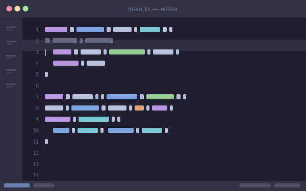
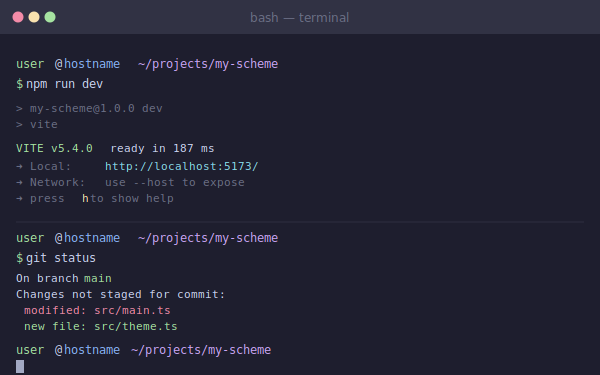
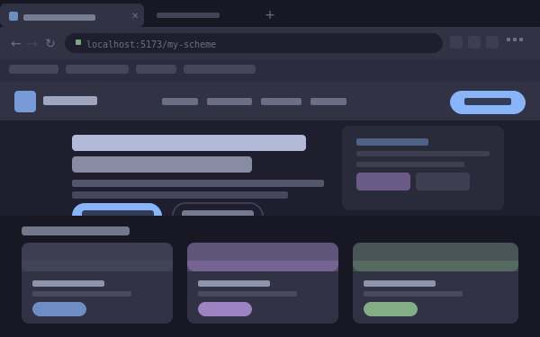
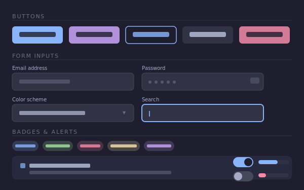
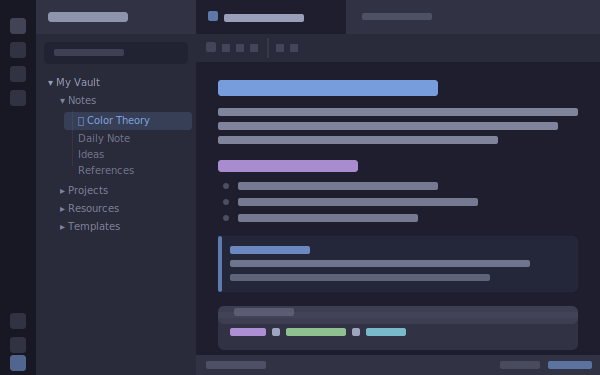

# My Scheme

Generate your own color scheme with a color picker, live previews across multiple applications, and export as CSS custom properties or ports for your favorite tools.

## Previews

The live preview renders your color scheme across multiple application types simultaneously. Below are the skeleton layouts for each preview mode.

### Editor

Code editor with syntax highlighting, sidebar, line numbers, active-line highlight, and a status bar.

### Terminal

Interactive shell session with prompt coloring, command output, and a block cursor.

### Browser (Firefox / Chrome)

Full browser chrome — tab bar, navigation bar with URL field, bookmarks bar — plus a themed webpage with navbar, hero section, and a card grid.

### HTML Components

A component palette showing buttons, form inputs, badges, alerts, toggles, and progress bars styled with your scheme.

### Obsidian

Obsidian-style layout: icon ribbon, file explorer tree, tabbed editor with markdown headings, bulleted lists, a callout block, and an inline code block.

---

## Interface

### Left Sidebar

- **Color picker**
    - By default, 16 color blocks are displayed in a list-style card
    - Click a color block to open a color picker dialog
    - Each list item shows the color swatch on the left and the name + hex/rgb/hsl/oklch values on the right
    - A **"Add color"** button at the bottom lets you add custom colors
- **Preview**
    - Live preview of your color scheme applied to simulated interfaces
    - Switch between preview modes: Editor · Terminal · Browser · HTML Components · Obsidian
- **Export**
    - Export your scheme in multiple formats:
        - CSS custom properties
        - Base16 / Base24 / Base46 ports
        - NvChad theme
        - Tinted Theming port
        - Shareable hash URL — when opened, the color scheme is automatically restored
